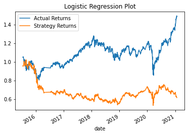

# Module 14 Challenge

## Overview of the Analysis

*  This challenge compares logistic regression predictions to SVC classifier based baseline predictions. After completing the base case (baseline SVC and logistic regression models), the two models were re-evaluated two more times by altering the training size and SMA windows. The default (base case) training size was an offset of 3 months with short and long SMA windows of 4 and 100, respectively. The first alternative evaluated the impact of modifying the training size to 6 months (keeping default SMA windows). The second alternative evaulated the impact of modifying the short and long windows to 2 and 120, respectively, and kept the default training size input.
## Results

 The logistic regression model out performed the baseline model in all three scenarios shown below.

* Base Case: SVC and Logistic Regression classifiers used for Baseline and Second models, respectively
  
  * Baseline Plot
  
   
  * Baseline Stats 55% Accuracy
  
   
  * Logistic Regression Plot

   
  * Logistic Regression Report 66% Accuracy

   

* ML Alternative 1: Dateoffset changed to 6 months
  * Alternative 1 Baseline Plot

   
  * Alternative 1 Baseline Report 56% Accuracy

   
  * Alternative 1 Logistic Regression Plot

   
  * Alternative 1 Logistic Regression Report 58% Accuracy

   

* ML Alternative 2: 2 and 120 short and long windows, respectively
  * Alternative 2 Baseline Plot

   
  * Alternative 2 Baseline Stats 56% Accuracy

   
  * Alternative 2 Logistic Regression Plot

   
  * Alternative 2 Logistic Regression Stats 60% Accuracy

    

## Summary

* The set of models in the base case outperformed both alternatives. The firm should utilize the base case logistic regression model to ensure its competitive advantage in the market.

